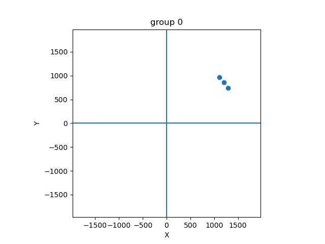
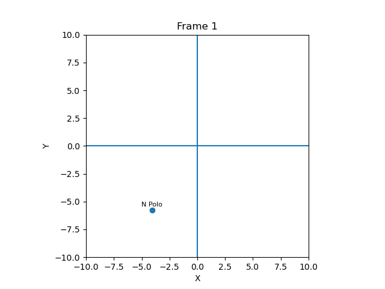

# Fragen – Streaming Systems Praktikum (WS 2025/26)

## Aufgabe 1 – Installation (Apache ActiveMQ & Kafka)

1. Für die Installation wurde eine zentrale `docker-compose.yml` angelegt. Damit können mehrere Container verwaltet, gestartet und gestoppt werden. Diese zentrale Datei wird im Laufe der Aufgaben erweitert, je nach Anforderungen. Die finale Datei beinhaltet 3 Container:

- Apache Kafka
- Apache AvtiveMQ
- Redis

Es wurden jeweils die aktuellsten offiziellen Container-Images der jeweiligen Tools als Basis verwendet. Zusätzlich wird in der `docker-compose.yml` ein virtuelles Netzwerk erstellt, damit alle Container untereinander sowie über definierte Ports mit dem Hostssystem kommunizieren können. Für die Datenspeicherung können persistente Volumes des Hostsystems eingehängt werden, falls notwendig.

2. Die Leistungsfähigkeit wird als gut befunden, Docker im allgemeinen bietet weniger Overhead als eine vollwertige virtuelle Maschine, aber mehr als eine native Installation. Auf einem Laptop mit 8 GB Arbeitsspeicher ist die Speichergröße nicht ausreichend, um alle Aufgaben zu hosten. 16 GB sind dagegen ausreichend. Das Starten und Stoppen der Container ist sehr performant und braucht ca. 3 s. 

4. Um die korrekte Installation zu prüfen, werden simple Aufrufe der jeweiligen CLI-Tools sowie die Kommunikation der Container untereinander getestet. Die Logs der Container werden überprüft und etwaige Fehler werden behoben. Sobald alle Logs "sauber" sind, ist die Installation und Inbetriebnahme abgeschlossen.

5. Logs

6. Für die Erstellung der Konfiguration wurde ChatGPT verwendet, da die genaue Syntax und Parameter der Container nicht genau bekannt sind. Die Qualität wird als gut befunden, die Container sind direkt beim ersten Aufruf erfolgreich verfügbar und einzelne Parameter können in weiteren Prompts hinzugefügt werden (z.B Portfreischaltungen). Es ist keine manuelle Modifizierung der `docker-compose.yml` notwendig. Dadurch fällt das Durchsuchen der Dokumentation jedes Containers weg und der Produktivitätsgewinn ist hoch.

7. /

---

## Aufgabe 2 – JMS & LiDAR-Datenverarbeitung

1. Die Beispiele der Vorlesung sowie die mitgelieferten Code-Snippets sind in Java verfasst. Auch Apache Kafka ist Java-nativ. Daher wird Java für die Implementierung *aller*  Aufgaben gewählt. Der Code der Anwendung wird wie folgt aufgeteilt:

```
src
├── App.java
├── Consumer.java
├── Publisher.java
├── interfaces
└── models
    ├── LidarDataGrouped.java
    ├── LidarData.java
    └── LidarDistance.java
```

In künftigen Aufgaben werden Interfaces benötigt. Diese werden im Ordner `interfaces` abgelegt. `models` wird alle Datenklassen und PODs beinhalten. `Consumer.java` und `Publisher.java` sind Helferklassen, welche eine Abstraktion von "Messages schreiben/lesen" mit Hilfe von JMS sind. In dieser Aufgabe wird ActiveMQ verwendet. Wird ein Publisher erstellt, kann dieser mit Hilfe der Methode `publish` eine einzelne Nachricht an den Message Broker senden. Wird ein Consumer verwendet, wird im Konstruktor ein Callback übergeben, welches als einziges Parameter eine empfangen Nachricht enthält. Zusätzlich kann jeweils die Topic und Startparameter wie der Hostname und der Port des Message Brokers übergeben werden. Dadurch muss nicht für jede Teilaufgabe die simple Handlung von "lies/schreib eine Nachricht" implementiert werden.

Die Model-klassen im Ordner `models` repräsentieren jeweils einen Datenpunkt nach einer Transformation. Da es insgesamt 3 Verarbeitungsschritte in der Aufgabenstellung gibt, gibt es ebenso 3 Datenmodelle. Für jedes der Datenmodelle werden die beiden Methoden `toJsonString` und `fromJsonString` implementiert. Dafür wird die Bibliothek `json_simple` genutzt. Prinzipiell wäre es sinnvoll, dafür ein Interface zu definieren. Jedoch erlaubt Java nicht, in einem Interface eine Methode als `static` zu deklarieren. Dies ist notwendig, da ansonsten die `fromJsonString` eine Instanz benötigt, um eine weitere aus einem JSON-Datum zu parsen. Dies ist semantisch unsinnvoll. Außerdem hätte einfach das Interface `Serializable` implementiert werden können. Dadurch wäre allerdings die einfach Ausgabe für Debuggingzwecke nicht mehr möglich gewesen. In späteren Aufgaben wird diese Methode dennoch verwendet. Für die Handhabung und Verarbeitung von 2D-Vektoren wird die Klasse `Vector2D` implementiert. Diese bietet die üblichen Methoden `distance`, `normalize`, `delta` usw.

Zur Lösung der Aufgabe wird eine zentrale `App.java` erstellt, die über Startparameter die auszuführende Teilaufgabe auswählt und startet. Es gibt folgende Startparameter:

- `--publisher`
- `--consumer_group`
- `--consumer_distance`
- `--consumer_summation`

Der Publisher liest die mitgelieferte Datei `Lidar-scans.json` ein und schreibt diese in das Topic `LIDAR_RAW`. Der Konsument `consumer_group` liest diese Topic aus, gruppiert die Messwerte und schreibt diese in das Topic `LIDAR_GROUPED`. `consumer_distance` und `consumer_summation` funktionieren analog. Beim Starten des Konsumenten `consumer_summation` wird die Ausgabe von `stdout` in eine Ausgabedatei gepiped. Der Publisher führt direkt nach dem Parsen der Datenpunkte die Filterung über die Qualitätsmetrik durch. "Falsche" Werte werden somit so früh wie möglich herausgefiltert und müssen nicht weiter verarbeitet werden. Dadurch entstehen keine Probleme bei der Gruppierung, da die Werte monoton in der Datei angeordnet sind.

2. Die Leistungsfähigkeit des Systems wird als gut eingeschätzt. Durch den Callback-Mechanismus des Consumers wird mit einer konfigurierbaren Frequenz gepollt. Angenommen, das Polling ist sinnvoll implementiert, werden dadurch kaum CPU-Ressourcen verwendet, solange keine Nachrichtenverarbeitung durchgeführt wird. Die Verbindungen zum Message Broker werden nur einmalig aufgebaut und offen gehalten, was ebenfalls die Performanz steigert. Die Serialisierung der Daten sowie die Netzwerkkommunikation sind das größte Bottleneck. Durch die Unterteilung der Transformationen in einzelne, unabhängige Instanzen können einzelne Teile davon skaliert werden. Diese Aufgabe benötigt einen Laptop mit >= 16GB Arbeitsspeicher. Auf einem MacBook M1 Pro mit 8 Kernen benötigt die gesamte Verarbeitungskette, inklusive Starten der JVM 10s. Damit wird ein Durchsatz von ~4429 Datensätzen/Sekunde erreicht, was als passabel eingestuft wird. Die Leistung wird tendentiell besser, wenn mehr Datenpunkte als Input genutzt werden, da dann der Overhead der JVM relativ geringer wird. Eine Überwachung der Kernauslastung mit `htop` zeigt, dass der Großteil der Kerne kaum ausgelastet sind, während andere zu ca.70% ausgelastet sind. Dies bestätigt die Annahme, dass das Netzwerk ein vorviegender Bottleneck ist.

3. Siehe 2.

4. Um die Korrektheit zu testen, werden die Ausgabewerte jeder Transformation manuell auf Plausibilität untersucht, indem alle Nachrichten auf der Konsole geloggt werden. Zudem werden die Endergebnisse der gesamten Kette mit den mitgelieferten Beispielwerten verglichen. Die Ergebnisse werden zusätzlich mit denen von anderen Teams verglichen, um eine zusätzliche, generelle Plausibilitätsprüfung zu haben.

5. Bereits hier könnten die Datenpunkte mit Python o.Ä. visualisiert werden (z.B. 2D-Scatterplot). Wir haben dies erst ab Aufgabe 3 realisiert und hier noch auf die Textausgabe mit Logs gesetzt.

6. ChatGPT wurde verwendet, um den Consumer und Publisher zu implementieren. Hierbei wurden die API-Aufrufe generiert, die das Senden/Pollen von Nachrichten zum/vom Message Broker durchführen. Auch hier wurde dies so gemacht, um zu vermeiden, die Dokumentation der jeweiligen Bibliotheken durchsuchen zu müssen. Ca. 10% des Codes der gesamten Aufgabe sind somit KI-generiert. Der Produktivitätsgewinn ist hoch, die Qualität wird als gut bewertet, da der Code bereits bei der ersten Verwendung funktioniert. Zudem werden "versteckte" Features wie das Zurücksetzen der Gruppen-ID direkt implementiert, was bei manueller Implementierung vermutlich Zeit zum "Entdecken" gebraucht hätte.

7. Es wurde `json_simple` für die Implementierung der (De-)Serialisierung verwendet. Ein externes Bash-Skript für das Starten/Stoppen aller Teilaufgaben wurde implementiert. Dadurch wird einfach Zeit eingespart, um Iterationen während der Entwicklung schneller zu testen. Das ganze Projekt wird mit Maven gebaut, was das Dependency-Management vereinfacht und die Ausführung auf verschiedenene Plattformen (Linux, MacOS) deutlich vereinfachte.

## Aufgabe 3 – Apache Kafka

1. Für diese Aufgabe wird die Implementierung von Aufgabe 2. wiederverwendet. Es werden lediglich neue Implementierungen der Klassen Consumer und Publisher angefertigt. Diese interagieren nun nicht mehr über JMS mit ActiveMQ sondern direkt mit einem Kafka-Server. Daher sind Inbetriebnahme und Debugging ebenfalls gleich. Die berechneten Werte sind binär identisch (wie zu erwarten ist, wenn die Implementierung der Transformationen gleich bleibt).

Für die Visualisierung wird ein Python-Skript mit Matplotlib erstellt, das die Datenpunkte jeder Gruppe in einem 2D-Scatterplot "von oben" zeigt. Die einzelnen Frames werden als GIF zusammengestellt und sehen wie folgt aus:



(Leider haben wir keine Möglichkeit gefunden, GIFs in PDFs einzubetten, deswegen finden sie die GIFs separat in der Abgabe)

Man könnte natürlich auch andere Tools wie Plotly oder Grafana verwenden, aber wir waren/sind mit der animierten Grafik zufrieden. Wir haben die Zusammenführung der einzelnen Teilaufgaben in eine Ausführungsinstanz nicht vorgenommen, da dabei die gute Skalierbarkeit verloren geht. Die Umsetzung mit der aktuellen Architektur ist sehr simpel, da einfach mehrere der Startparameter mitgegeben werden können.

2. Siehe Aufgabe 2.2. Die Leistungsfähigkeit ist erneut durch (De)Serialisierung/Netzwerk beschränkt. Bei der Messung des Durchsatzes kommen sehr ähnliche Werte wie bei der Umsetzung mit JMS zustande (+-10%).

3. Siehe 2. bzw. 2.2

4. Auch hier werden manuelle Tests jeder Transformation durchgeführt. Die Werte werden mit `diff` mit denen von Aufgabe 2. verglichen und sind identisch. Zudem wird durch die Visualisierung ein plausibles LIDAR-Umfeld ersichtlich, was auch zwischen Gruppen/Frames nahezu gleich bleibt. In der Visualisierung ist erkennbar, dass Sprünge zwischen okkludierten Objekten generiert werden, was eine natürliche Konsequenz des LIDAR-Arbeitsprinzips ist.

5. Siehe 1. und 4. Visualisierung mit Matplotlib.

6. ChatGPT wurde verwendet, um die Kafka-Implementierungen der Klassen `Consumer` und `Publisher` zu generieren. Dadurch wurde erneut Aufwand gespart, da keine Dokumentation gelesen werden musste. Erneut ist der KI-Code-Anteil recht gering (ca. 10%), die Businesslogik aus Aufgabe 2. wird übernommen und ist vollständig handgeschrieben. Auch hier hat die Implementierung beim ersten Versuch funktioniert und es wurde dadurch viel Arbeitszeit eingespart.

7. Wie in Aufgabe 2. wird `json_simple` für die (De-)Serialisierung der Datenmodelle und ein Bash-Skript für das Starten/Stoppen der Instanzen verwendet.

---

## Aufgabe 4 – CQRS & Event Sourcing

1. Die Architektur dieser Aufgabe hält sich sehr eng an die gezeigte Struktur aus der Vorlesung. Zunächst werden im Ordner `interfaces` die drei vorgegebenen Interfaces angelegt. Anschließend werden folgende Klassen angelegt, die jeweils eines der Interfaces implementieren:

- `VehicleCommandHandler` -> `VehicleCommands`
- `VehicleRepository` -> `Query`
- `models/VehicleInfo` -> `VehicleDTO`

Zusätzlich werden folgende Datenklassen erstellt:

- `models/commands/VehicleCommand`
- `models/commands/VehicleCommandCreate`
- `models/commands/VehicleCommandMove`
- `models/commands/VehicleCommandRemove`
- `models/Position`

Die Klasse `Position` wird erstellt, indem einfach die Klasse `Vector2D` aus vorherigen Aufgaben umbenannt wird. Zudem wird sie auf eine Implementierung als `record` umgestellt. Mehr dazu später. Die abstrakte Klasse `VehicleCommand` stellt den gemeinsamen Datentyp aller Commands dar. Sie beinhaltet den Fahrzeugnamen (Jeder Command referenziert ein Fahrzeug), sowie die beiden (abstrakten) Methoden:

```
public abstract void applyToQueryModel(<Q> queryModel);
public abstract void applyToDomainModel(<D> domainModel);
```

Die Klasse ist abstrakt, weil es keinen Sinn ergibt, ein allgemeines "VehicleCommand" zu erstellen. Daher werden die Unterklassen (siehe oben) erstellt. Diese beinhalten zusätzlich zum Fahrzeugnamen noch weitere notwendige Daten, die von der vorgegebenen API abgeleitet werden. Beispielsweise beinhaltet die Klasse `VehicleCommandCreate` noch das Datum `StartPosition`. Erneut implementiert jede Klasse die from/to JSON Methoden. Ein serialisierter `VehicleCommandCreate`-Befehl sieht z.B. so aus:

```
{
   "type": "create",
   "name": "VW Golf mit Allrad",
   "startPosition": {
      "x": 50.0,
      "y": 42.0 
   }
}

```

Die beiden abstrakten Methoden sind dazu da, um jedem Befehl selbst die Wahl zu lassen, welchen Einfluss seine Ausführung auf das Domänen-/Querymodell hat. Die Typen `<Q>` und `<D>` unterscheiden sich zwischen den einzelnen Versionen, die wir implementieren mussten. Bei Version 3 sind diese Typen beispielsweise `HashMap<String, VehicleDTO>` und `HashSet<String>`. Durch diese Architektur können sehr einfach neue Befehle hinzugefügt oder bestehende Befehle angepasst werden. Sie hat jedoch den Nachteil, dass, wenn der Modelltyp von entweder Domäne oder Query geändert wird, die beiden `apply...` Methoden aller Befehle angepasst werden müssen. Eine Alternative wäre es, die Modifikation direkt im Repository bzw. im CommandHandler vorzunehmen. Dann würden diese beiden Klassen allerdings wieder "dicker". Die Validierung vor der Befehlsausführung erfolgt zentralisiert im CommandHandler bzw. im Reposiroty. Die Klassen CommandHandler und VehicleRepository sind als Singleton implementiert, damit in den späteren Versionen die Interaktion zwischen beiden vereinfacht wird. Die tatsächliche Kommunikation mit dem Kafka-Server erfolgt erneut auf den in den Aufgaben 2 & 3 entwickelten Klassen `Consumer` und `Producer`.

Die Projektion des CQRS-Modells wird über die Methode `applyToQueryModel` abgebildet. Auf dem Server sind nur die Commands gespeichert. Das Repository bildet die Projektion, indem es alle Messages des Command-Topics abruft und sukzessive über diese Methode "faltet".

Nun zu den "Fragen am Rande":

1. Warum sollte `Position` die Schnittstelle `Comparable` implementieren?
Damit man Instanzen vergleichen kann. Das ist notwendig um beispielsweise eine Position als Schlüssel in einer HashMap verwenden zu können.

2. `Position` ist ein „reines“ Datenobjekt – würde das nicht für eine `record`-Umsetzung sprechen?
Ja.

3. Was spricht dagegen?
Wir haben nix gefunden und das Ganze als record implementiert. Funktioniert super. Ein potentieller Grund wäre, wenn die Daten in-Place mutiert werden müssten.

### Version 2:

Für die Version 2 des Systems wird das Domänenmodell aus der Write-Seite entfernt und der CommandHandler bekommt eine Referenz auf das Repository, um den bisher bekannten Zustand abzufragen. Beim Starten des Repositories zieht sich die Instanz einmalig alle bisherigen Nachrichten und hydriert damit das QueryModell. Weitere Messages werden auf diesen Zustand "addiert", indem erneut die Methode `applyToQueryModel` verwendet wird. (Im Callback des Consumers)

### Version 3:

1. Wird die Funktion `moveVehicle` des CommandHandlers aufgerufen, fragt dieser über das Repository ab, wie viele Bewegungen bereits für ein Fahrzeug bekannt sind. Wenn diese Zahl > 5 ist, wird anstelle eine `move`-Befehls einfach ein `remove`-Befehl an den MessageBroker geschickt.

2. Für diese Umsetzung muss die gesamte Historie der Position eines Fahrzeugs bekannt sein. Dazu wird das Interface `VehicleDTO` um folgende Funktion erweitert: `public List<Position> getPreviousPositions();`. (Das Erweitern der Schnittstelle ist nicht explizit verboten, es sind "nur Getter" erlaubt.). Anschließend wird die Implementierung `VehicleInfo` so modifiziert, dass sie anstatt einer einzelnen Position eine Liste mitführt. Die zuletzt eingefügte Position ist die aktuelle (für `getPosition`). Die Funktion `getNumberOfMoves` gibt nun einfach die Länge der Liste (-1) zurück. Entsprechend wird die Implementierung von `VehicleCommandMove` angepasst. Nun kann im Repository die gewünschte Abfrage `getPreviousPositions` hinzugefügt werden. Damit kann der CommandHandler vor dem Ausführen eines `move`-Befehls prüfen, ob die Bewegung "legal" ist und erneut bei Bedarf einen `remove`-Befehl absetzen.

3. Hierfür sucht der CommandHandler alle Fahrzeuge an der neuen Position des bewegten Fahrzeugs (mit kleinem Umkreis wegen Float-Präzisionsfehlern). Für jedes dieser Fahrzeuge wird ein `remove`-Befehl abgesetzt. Anschließend wird das bewegte Fahrzeug tatsächlich bewegt.


### Version 4 – (Optional)

Aus Zeitgründen nicht durchgeführt.


2. Die Leistungsfähigkeit wird als "okay" eingeschätzt. Insgesamt entsteht der Eindruck, das System ist sehr overengineered, was vermutlich der simplen Anwendung zugrunde liegt. Durch die Entkopplung von Lesen und Schreiben entsteht ein Zeitverzug, welcher messbar die Ausführung einzelner Queries (also bis das Ergebnis "da" ist, nicht die eigentliche Aufrufszeit) steigert. Die Startzeit des Systems steigt proportional mit der Anzahl gespeicherter Commands, da das Repository erst alle Nachrichten verarbeiten muss. Hier könnte ein Snapshot-System deutliche Vorteile bezüglich Performanz bringen.

3. Theoretisch ist das System gut skalierbar, da die Lese- und Schreibseiten unabhängig skaliert werden können. Beim Testen ist auffällig, dass es durch die Verteilung auf mehrere Knoten zu Race Conditions kommen kann. Dadurch ist es möglich, dass zwei Knoten einen leicht veralteten Stand haben, wenn das Repository noch nicht alle neuen Nachrichten verarbeitet hat. Somit können beide einen `create`-Befehl absetzen und das gleiche Fahrzeug würde zweimal erstellt. Dies wird zwar auf der Seite des Repository durch die Implementierung von `applyToQueryModel` wieder abgefangen, erzeugt aber fehlerhafte/redundante Logs. Ebenso wurde kein Load-Balancing o.Ä. genauer betrachtet, was allerdings in einem Produktivsystem die Last einzelner Knoten deutlich senken könnte.

4. Alle Versionen wurden bereits während der Implementierung getestet. Analog zu den vorherigen Aufgaben gibt es neue Startparameter für die zentrale `App.java`-Datei. Hierbei wurden ad-hoc Tests durchgeführt. Es wird geprüft, ob Dopplungen entstehen können und ob alle Validierungen korrekt funktionieren (z.B. ob ein Fahrzeug öfter als 5 mal bewegt wurde). Zudem wurden mit ChatGPT Unit-Tests generiert, die eben diesen Vorgang automatisieren. Die Tests wurden manuell überprüft, um die Sinnhaftigkeit und Korrektheit zu bestätigen.

5. Auch hier wird eine Visualisierung mit MatplotLib erstellt. Diese zeigt ein Beispielszenario mit erfundenen Daten, die sämtliche "Extremfälle" abbilden. Jeder "Frame" zeigt den Zustand, nachdem jedes Fahrzeug entweder bewegt, erstellt oder entfernt wurde.



6. ChatGPT wurde verwendet, um das Konzept von CQRS besser zu verstehen. Die Erklärungen der KI sind allerdings mehr oder weniger nützlich, da sie teilweise wiedersprüchlich sind. Dadurch wurde eher keine Zeit eingespart. Der Code für die Visualisierung der Fahrzeugbewegungen wurde KI-generiert (Sinnvolle Daten mit Extremfällen, die Simulation/Auswertung erfolgt natürlich über das implementierte CQRS-System). Der Code für die Kommunikation mit Kafka ist nach wie vor KI-generiert (Consumer/Publisher). Diese Erfahrung zeigt (wie so oft) dass die KI noch erhebliche Probleme mit komplexen Problemstellungen hat, für einfache "Boilerplate"-Aufgaben gibt es dennoch Produktivitätsgewinne (z.B. Visualisierungsskript)

---

## Aufgabe 5 – Apache Beam & Datenanalyse

1. Für diese Aufgabe wurde der Datentyp `SpeedEvent` angelegt, der die drei Daten aus `Trafficdata.txt` abbildet. Anschließend wurde eine Beam-Pipeline mit folgenden Schritten erstellt:

   1. Einlesen der Datensätze aus Kafka (KafkaIO)
   2. Parsen: String -> SpeedEvent
   3. Filtern: Ist Speed(m/s) >= 0?
   4. Windowing (10 Sekunden)
   5. Extrahieren der Geschwindigkeiten
   6. Berechnen der Durchschnittsgeschwindigkeit eines Fensters
   7. Umrechnung von m/s -> km/h
   8. Formatieren: (SensorID, Durchschnittsgeschwindigkeit) -> String
   9. Schreiben der Datensätze in Ausgabedateien (TextIO)

Die einzelnen Schritte wurden für bessere Lesbarkeit in Unterklassen ausgelagert. Diese sind alle in `traffic/CustomTransforms.java` zu finden. Die Pipeline ist recht lang für das was sie macht. Zum Beispiel kann das Umrechnen in km/h und die Berechnung des Durchschnitts kombiniert werden. Das haben wir hier nicht gemacht, weil so der Code lesbarer bleibt und es sich ohnehin um geringe Datenmengen handelt. Für das Publishen der Datensätze wird der Kafka-Publisher aus vorherigen Aufgaben wiederverwendet. Die Datei wird Zeile für Zeile eingelesen und auf den Server hochgeladen (wieder über den `Producer` aus vorherigen Aufgaben). Dabei wird bereits das Timestamp geparsed und dem Server übergeben, damit auf der Beam-Seite das extrahieren einfacher ist. Da die Timestamps in der Vergangenheit liegen, wird zudem eine `TimestampPolicyFactory` implementiert, damit die Timestamps von 2025 verwendet werden können.

2. Die Leistungsfähigkeit der Lösung ist sehr gut, die Pipeline ist bei Tests auch mit hunderdtausenden Datensätzen in wenigen Sekunden durch. Wie in 1. geschildert, könnte die Verarbeitung noch weiter optimiert werden, indem weniger Stages verwendet werden, die mehr auf einmal machen. Damit ist der Overhead der Orchestration geringer. Zusatzfunktionen wurden ansonsten nicht implementiert. Ein bemerkenswertes Feature ist der simple und lineare Aufbau der Pipeline, wodurch bei jedem Verarbeitungsschritt leicht Daten abgegriffen werden können. Auch die Abänderung der Verarbeitung ist sehr einfach.

3. Wie in 3. erwähnt, wurden synthetische Daten generiert, um mehr als nur 2000 Datensätze zum Testen zu haben. Dabei haben wir festgestellt, dass bei 2000 Datensätzen der Overhead von Beam deutlich schwerer ins Gewicht fällt als die eigentliche Bearbeitung.

4. Hauptsächlich manuelles Testing und Logging jedes Pipeline-Steps. Zudem wurden für die Mengen der Daten der einzelnen Steps geprüft, ob diese in sinnvollen Größenordnungen liegen.

5. Auch hier könnten die Ausgabedaten in einem Graphen geplottet werden, was wir allerdings aus Zeitgründen nicht gemacht haben. Vermutlich würde man einigermaßen glatte Graphen ohne große Sprünge sehen, da ja die Durchschnittswerte der Fenster verwendet werden.

6. Der gesamte Code ist handgeschrieben, bis auf die Consumer und Producer der vorherigen Aufgaben. ChatGPT und Gemini wurden aber verwendet, um die genaue Syntax der einzelnen Befehle und Pipeline-Stage-Arten herauszufinden, insbesondere die Konfigurationsoptionen der KafkaIO- und TextIO-Stages. Der Produktivitätsgewinn im Vergleich zum manuellen "Durchblättern" der Dokumentation von Beam ist geschätzt sehr hoch.

7. Neben Kafka und Beam wurde noch die Bibliothek "Joda" benutzt, hauptsächlich weil Beam die Zeit-Typen (`Instant`, `Duration` und Co.) nutzt.

---

## Aufgabe 6 & 7 – CEP mit Esper / EPL

1. Für die Verwendung von EPL mit Esper wird zunächst der Initialisierungs-Tanz durchgeführt. Dabei wird eine Runtime erstellt, welche mit einer Konfiguration versehen wird. In der Konfiguration wird Esper informiert, welche Typen wir als Event verwenden möchten. Zusammen mit Aufgabe 7 haben wir dabei folgende Typen:

   - SpeedEvent
   - AverageSpeedEvent
   - SpeedChangeEvent

Anschließend wird in der Runtime der Zeitstempel auf das Datum des ersten Datensatzes gesetzt. Ansonsten würden alle eintreffenden Nachrichten als "vor der jetzigen Zeit" angesehen und verworfen werden.

Anschließend werden zwei Queries kompiliert und deployed. Die erste soll die gleiche Frage wie Aufgabe 5 beantworten, wobei die zweite die Änderungen der Geschwindigkeit von >= 20 km/h zu neuen Events machen soll. Für jede Query wird ein Listener hinterlegt, der die Eventdaten einfach auf der Konsole ausgibt. Anschließend wird ein weiterer `Consumer` für Kafka angelegt, der auf Nachrichten des Typs `SpeedEvent` lauscht und diese in Objekte parst. Anschließend wird der Zeitstempel des Events an die Esper-Runtime weitergegeben, damit diese ihren internen Zeitstempel vorantreiben kann. Dann wird das Event ebenfalls an die Runtime übergeben. Die Listener der einzelnen Queries werden dann asynchron von der Runtime aufgerufen. Da sich das Format und die Beschaffenheit der Daten nicht ändert, wird der Publisher aus Aufgabe 5. wiederverwendet. Es kommen die gleichen Ergebnisse wie in Aufgabe 5. raus.

Um die Apache Beam Pipeline aus 5. so anzupassen, dass sie auch die Geschwindigkeitsveränderungs-Events erkennt, könnten sie wie folgt erweitert werden:

   - Zusätzliches Windowing über Durchschnittsgeschwindigkeiten
   - Combine: Delta berechnen
   - Filter: Delta >= 20 km/h?

2. Die Leistungsfähigkeit ist erneut sehr gut, die Bearbeitung dauert wenige Sekunden, ebenfalls für große Datenmengen (100000+ Datensätze). Daher liegt auch hier die Vermutung nahe, dass der Overhead der Initialisierung deutlich größer ist als der Berechnungsaufwand.

3. Aus Zeitgründen haben wir keine zusätzlichen Funktionen implementiert.

4. Abgleich mit Ergebnissen aus Aufgabe 5.

5. Auch hier könnte man die gleiche Visualisierung wie in Aufgabe 5. anfertigen, mit der zusätzlichen Information der Geschwindigkeitssprünge als zusätzliche Markierungen/Punkte in den Graphen.

6. ChatGPT wurde verwendet, um den "Initialisierungstanz" von Esper und den EPL-Queries zu generieren. Auch die Queries selbst sind teilweise generiert, mussten aber immer händisch angepasst werden, weil die KI die Syntax nicht perfekt kennt. Die Zeitersparnis ist dennoch gut, da auch hier das Durchblättern der Dokumentation von Esper erspart bleibt.

7. Nur Esper/Kafka.

---
## Aufgabe 8 – Read-Process-Write Pattern (Kafka) mit Exactly-Once Semantik

**Ziel der Aufgabe:**  
In dieser Aufgabe wurde das Read-Process-Write-Pattern mit Apache Kafka so umgesetzt, dass jeder Datensatz exakt einmal verarbeitet wird – auch dann, wenn die Anwendung während der Verarbeitung abstürzt und anschließend neu gestartet wird. Der Schwerpunkt lag dabei nicht auf der fachlichen Logik, sondern auf der korrekten technischen Kopplung von:

- Lesen von Nachrichten
- fachlicher Verarbeitung
- Schreiben der Ergebnisse
- Offset-Commit in Kafka

Diese Beschreibung kombiniert die ursprüngliche Aufgabenbeschreibung mit den Antworten auf die allgemeinen Fragen zu Aufgabe 8 zu einem einheitlichen, zusammenhängenden Dokument.


### Architekturüberblick

Die Anwendung ist in mehrere klar getrennte Komponenten aufgeteilt, um die Exactly-Once-Semantik sauber und nachvollziehbar implementieren zu können:

- **TrafficReadProcessWriteApp**  
  Einstiegspunkt der Anwendung. Lädt die Konfiguration, startet die Engine und behandelt das ordnungsgemäße Herunterfahren.

- **KafkaEosReadProcessWriteEngine**  
  Kernkomponente für das transaktionale Read-Process-Write. Hier werden Input gelesen, verarbeitet, Ergebnisse geschrieben und Offsets transaktional committed.

- **TrafficProcessor**  
  Fachliche Verarbeitung der einzelnen Datensätze (Parsing, Validierung). Entscheidet, ob ein Record in das OUT- oder BAD-Topic geschrieben wird.

- **ProcessingResult**  
  Transportobjekt, das das Verarbeitungsergebnis kapselt.

- **TopicNames**  
  Zentrale Verwaltung der verwendeten Kafka-Topicnamen.

Zusätzlich wurde ein Bash-Skript (`run_task8.sh`) erstellt, das den kompletten Testablauf automatisiert: Topics werden zurückgesetzt, die Anwendung gestartet, ein künstlicher Absturz erzeugt, anschließend neu gestartet und die Ergebnisse automatisch verifiziert.


### Datenfluss

Der gesamte Datenfluss ist bewusst einfach gehalten:

```
                     +---------------------+
traffic-data  -----> |  Kafka Consumer     |
                     +---------------------+
                               |
                               v
                     +---------------------+
                     | TrafficProcessor    |
                     +---------------------+
                               |
                               v
                     +---------------------+
                     |  Kafka Producer     |
                     +---------------------+
                         /           \
                        /             \
                       v               v
        traffic-processed (OUT)   traffic-bad (BAD)
```

Jeder eingehende Datensatz wird genau einmal verarbeitet und abhängig vom Ergebnis entweder in das Topic:

- `traffic-processed` (gültige Datensätze)
- `traffic-bad` (fehlerhafte Datensätze)

geschrieben. Dadurch kann am Ende sehr einfach überprüft werden, ob die Verarbeitung vollständig und korrekt war.


### Exactly-Once Umsetzung

Die Exactly-Once-Semantik wird durch die Nutzung von **Kafka-Transaktionen** realisiert. Dabei gilt der zentrale Grundsatz:

> **Output schreiben und Offsets committen müssen in derselben Transaktion erfolgen.**

#### Ablauf in der Engine

Der technische Ablauf ist wie folgt implementiert:

1. Lesen eines Batches von Nachrichten aus `traffic-data`
2. Start einer neuen Kafka-Transaktion
3. Verarbeitung jedes Records über den `TrafficProcessor`
4. Schreiben der Ergebnisse nach OUT oder BAD
5. Speichern der Consumer-Offsets innerhalb der Transaktion
6. Commit der Transaktion

Tritt vor Schritt 6 ein Fehler auf, wird die Transaktion verworfen.  
Dadurch ist garantiert, dass entweder:

- sowohl Output als auch Offset-Commit erfolgen  
- oder beides nicht erfolgt  

So werden Duplikate und Datenverluste zuverlässig verhindert.

Im Rahmen der Implementierung wurde außerdem die maximale Anzahl der pro Poll verarbeiteten Records explizit begrenzt.  
Dies geschah über folgende Kafka-Consumer-Einstellung:

```
Props.put(ConsumerConfig.MAX_POLL_RECORDS_CONFIG, "500");
```

Durch diese Konfiguration wird sichergestellt, dass pro `poll()`-Aufruf maximal 500 Nachrichten verarbeitet werden.  
Dies verbessert die Stabilität der Anwendung und verhindert zu große Transaktionen oder zu lange Verarbeitungszeiten pro Batch.

#### Eindeutige Identifikation von Nachrichten

Jede ausgegebene Nachricht erhält zusätzlich einen eindeutigen Marker:

```
MID=<topic>-<partition>-<offset>
```

Diese Message-ID erlaubt es, nach einem Neustart zu prüfen, ob Datensätze doppelt verarbeitet wurden.

### Test und Verifikation

Zur automatischen Überprüfung wurde das Skript `run_task8.sh` implementiert.

#### Ablauf des Tests

Das Skript führt folgende Schritte aus:

- Zurücksetzen aller relevanten Topics
- Start der Anwendung
- Einspeisen von 2000 Testdatensätzen
- Erzwingen eines gezielten Absturzes vor dem Commit
- Neustart der Anwendung
- Warten auf vollständige Verarbeitung
- Prüfung der Ergebnisse

#### Prüfkriterien

Am Ende wird geprüft, ob folgende Bedingung erfüllt ist:

```
Input lines == Output lines + Bad lines
```

Zusätzlich wird geprüft, dass jede MID genau einmal vorkommt.

#### Beispielergebnis

| Metric       | Value |
|--------------|-------|
| Input lines  | 2000  |
| Output lines | 1809  |
| Bad lines    | 191   |
| Total        | 2000  |


| Verification          | Result |
|----------------------|--------|
| Counts match exactly | OK     |
| No duplicates        | OK     |

Damit ist nachgewiesen, dass die Implementierung auch bei Abstürzen korrekt weiterarbeitet und Exactly-Once garantiert.

---

### Bewertung der Lösung

#### Leistungsfähigkeit

Die Leistungsfähigkeit der implementierten Lösung wird insgesamt als sehr gut eingeschätzt. Durch die batchweise Verarbeitung der eingehenden Datensätze kann eine hohe Effizienz erreicht werden, da nicht jeder Record einzeln, sondern jeweils in größeren Blöcken verarbeitet wird. Der zusätzliche Overhead durch die Verwendung von Kafka-Transaktionen fällt dabei nur gering ins Gewicht. In den durchgeführten Tests konnten mehrere tausend Datensätze innerhalb weniger Sekunden vollständig verarbeitet werden. Die eigentliche fachliche Verarbeitung ist sehr leichtgewichtig und stellt keinen Engpass dar. Die hauptsächlichen Bottlenecks liegen, wie auch in den vorherigen Aufgaben, in der Netzwerkkommunikation mit Kafka sowie in der notwendigen Serialisierung und Deserialisierung der Nachrichten.

#### Skalierbarkeit

Auch hinsichtlich der Skalierbarkeit zeigt die Lösung sehr gute Eigenschaften. Kafka ermöglicht durch die Aufteilung von Topics in mehrere Partitionen eine horizontale Skalierung der Verarbeitung. Über Consumer Groups können mehrere Instanzen der Anwendung parallel betrieben werden, wodurch sich die Verarbeitungslast flexibel verteilen lässt. Die eingesetzte Exactly-Once Semantik bleibt dabei auch bei mehreren parallel arbeitenden Instanzen erhalten, da Kafka durch die transaktionale Verarbeitung und eindeutige Offsets eine konsistente Verarbeitung garantiert. Dadurch ist das System problemlos erweiterbar und kann auch bei steigenden Datenmengen effizient betrieben werden.

#### Korrektheit

Die Korrektheit der Implementierung wurde vollständig automatisiert überprüft. Dazu wurde ein reproduzierbarer End-to-End-Test entwickelt, der den gesamten Ablauf der Anwendung abbildet. Im Test wird zunächst ein kontrollierter Absturz während der Verarbeitung simuliert. Anschließend wird die Anwendung neu gestartet und die Verarbeitung fortgesetzt. Am Ende erfolgt eine automatisierte Prüfung der Ergebnisse. Dabei wird kontrolliert, ob die Anzahl der verarbeiteten Datensätze vollständig ist und ob keine Duplikate entstanden sind. Durch diese Tests konnte zuverlässig nachgewiesen werden, dass die Exactly-Once Semantik auch im Fehlerfall korrekt eingehalten wird.

#### Visualisierung

Für diese Aufgabe war keine grafische Visualisierung erforderlich. Die Überprüfung der Ergebnisse erfolgte ausschließlich zahlenbasiert über das bereitgestellte Testskript. Die tabellarische Auswertung der Input-, Output- und Bad-Datensätze sowie die Prüfung auf Duplikate sind ausreichend, um die Korrektheit der Verarbeitung eindeutig nachzuweisen.

#### Einsatz von KI

Im Rahmen der Aufgabe wurde ChatGPT intensiv unterstützend eingesetzt. Die KI half insbesondere bei der Erstellung des Grundgerüsts für die transaktionale Kafka-Verarbeitung, bei der Entwicklung des automatisierten Testskripts sowie bei verschiedenen Konfigurationsfragen rund um Kafka und die Exactly-Once API. Ein großer Teil der initialen Codebasis – vor allem die Grundstruktur der Read-Process-Write-Engine und der transaktionale Ablauf – entstand mithilfe von KI-Vorschlägen.

In der praktischen Umsetzung zeigte sich jedoch, dass viele Probleme nicht im generierten Code selbst lagen, sondern in der Umgebung und im Testaufbau. Insbesondere bereits vorhandene Restdaten in den Kafka-Topics führten dazu, dass die Pipeline scheinbar „verstopft“ war und die Anwendung unerwartetes Verhalten zeigte. Das zuverlässige Zurücksetzen der Topics, das korrekte Offset-Handling und das saubere Neustarten der Anwendung mussten daher manuell ausgearbeitet und mehrfach angepasst werden. Auch die Fehlerbehandlung und das Zusammenspiel von Consumer, Producer und Transaktionen erforderten umfangreiche eigene Debugging-Arbeit.

Insgesamt wird der Anteil KI-generierten Codes auf etwa 60–75 % geschätzt. Der Einsatz der KI beschleunigte die Entwicklung deutlich und erleichterte den Einstieg in die komplexe Thematik erheblich, während die finale Stabilisierung und das Debugging der Umgebung hauptsächlich manuell erfolgen mussten.

---

### Reflexion

# Vergleich von Messaging- und Event-Processing-Systemen

## 1. Übersichtstabelle der Kernkriterien

| Kriterium | JMS (Java Messaging Service) | Apache Kafka | Apache Beam | CEP (Esper / EPL) |
| :--- | :--- | :--- | :--- | :--- |
| **Hintergrund** | Standard API für Messaging | Verteiltes, persistentes Log | Unified Model für Batch/Stream | In-Process Pattern Matching |
| **Primärer Fokus** | Entkopplung von Apps | Hoher Durchsatz & Speicherung | Komplexe Datenpipelines | Echtzeit-Mustererkennung |
| **Speicherung** | Kurzfristig (bis Abruf) | Dauerhaft (einstellbar) | Keine (nur Verarbeitung) | In-Memory (Zustand) |

---

## 2. Detaillierte Bewertung nach Kriterien

### 1. Repräsentation von Ereignissen
* **JMS:** Nutzt fest definierte Objekttypen (`TextMessage`, `MapMessage`, `ObjectMessage`). Vererbung wird unterstützt, ist aber oft starr. Metainformationen werden in Standard-Headern (z. B. `JMSCorrelationID`) mitgeführt.
* **Kafka:** Arbeitet rein auf Byte-Ebene (Key-Value-Paare). Die Datenstruktur ist extrem flexibel (JSON, Avro, Protobuf). Metadaten wie Timestamps oder Header sind vorhanden, aber die Interpretation liegt beim Client.
* **Beam:** Nutzt stark typisierte `PCollections`. Unterstützt komplexe Objekte und Vererbungsstrukturen via "Coder". Sehr flexibel für Transformationen.
* **Esper:** Repräsentiert Events als Java-Objekte (POJOs/Records), Maps oder XML. Es ist sehr flexibel und unterstützt Vererbung (Super-Events), was komplexe Hierarchien in EPL-Anfragen erlaubt.

### 2. Erzeugung und Übermittlung
* **JMS:** Übermittlung an eine Queue oder ein Topic via `MessageProducer`. Bündelung (Batching) ist nur bedingt über Transaktionen möglich.
* **Kafka:** Produzenten senden Records an Topics. Kafka ist auf **Bündelung** optimiert; Nachrichten werden für maximalen Durchsatz oft gesammelt übertragen.
* **Beam:** Erzeugt Daten über Source-Connectors. Übermittlung erfolgt innerhalb der Pipeline-Struktur.
* **Esper:** Ereignisse werden per API (`runtime.getEventService().sendEventBean()`) direkt in die Engine "gepusht". Da es In-Process läuft, entfällt der Netzwerk-Overhead eines Brokers.

### 3. Konsumentenstrategien
* **JMS:** Unterstützt **Push** (`MessageListener`) und **Pull** (`receive()`). Bietet Point-to-Point (Queue) und Publish/Subscribe (Topic).
* **Kafka:** Nutzt ein **Pull-Modell**. Konsumenten (Consumer Groups) fragen Daten aktiv ab und verwalten ihren Lesefortschritt (Offset) selbst.
* **Beam:** Verarbeitet Datenströme als Ganzes. Die Strategie wird durch den gewählten "Runner" (z. B. Flink, Spark, Dataflow) bestimmt.
* **Esper:** Ereignisse werden über Listener (`UpdateListener`) verarbeitet, die sofort triggern, wenn ein Muster (EPL) zutrifft (**Push**).

### 4. Dauerhafte Speicherung
* **Kafka:** Das einzige System, das Daten standardmäßig **persistent** auf Festplatten speichert.
* **JMS:** Speichert Nachrichten nur so lange, bis sie konsumiert wurden (oder das Zeitlimit abläuft).
* **Beam & Esper:** Speichern Ereignisse nicht dauerhaft. Sie sind für die reine Verarbeitung zuständig.

### 5. Auslieferungs- und Verarbeitungsgarantien
* **JMS:** Unterstützt *At-most-once* und *At-least-once*.
* **Kafka:** Unterstützt *At-least-once* und durch transaktionales Schreiben auch *Exactly-once*.
* **Beam:** Fokus liegt auf *Exactly-once* (abhängig vom Runner).
* **Esper:** Garantiert korrekte In-Memory-Verarbeitung; bei Systemabsturz geht der aktuelle Zustand jedoch verloren, sofern er nicht extern gesichert wurde.

### 6. Sicherheit
* **Alle Systeme:** Unterstützen Verschlüsselung via TLS/SSL.
* **JMS/Kafka:** Bieten Authentifizierung (SASL, Zertifikate) und Autorisierung via ACLs.
* **Beam/Esper:** Hier hängt die Sicherheit oft von der Host-Anwendung oder der Cloud-Umgebung ab.

### 7. Programmiermodell & Zeitrechnung
* **JMS:** Imperativ (Nachricht kommt -> Methode wird ausgeführt). Keine native Unterstützung für Zeitfenster oder Event-Time.
* **Kafka:** Kafka Streams erlaubt zustandsbehaftete Transformationen, Aggregationen und Fenster. Event-Time wird unterstützt.
* **Beam:** Das spezialisierteste Modell für **Event-Time**. Bietet Watermarks, Triggers und Windowing-Konzepte (Fixed, Sliding, Session).
* **Esper:** Deklarative Sprache (**EPL**). Extrem stark bei **Aggregationsfunktionen** und zeitlichen Mustern (`->` Operator). Auswertung nach Ereigniszeit ist durch explizites Vorrücken der Zeit möglich.

### 8. & 9. Skalierung und Ausfallsicherheit
* **Kafka:** Skaliert hervorragend **horizontal** durch Partitionierung. Ausfallsicherheit durch Replikation (ISR-Modell).
* **JMS:** Skaliert oft nur vertikal oder durch komplexere Broker-Cluster. Ausfallsicherheit via Master-Slave.
* **Beam:** Skaliert über den Runner (z. B. tausende Knoten in Google Dataflow). Ausfallsicherheit durch Checkpointing.
* **Esper:** Meist auf einen Knoten beschränkt (In-Memory). Skalierung und Ausfallsicherheit müssen oft auf Anwendungsebene (z. B. durch Sharding der Sensoren) gelöst werden.

### 10. Typsicherheit
* **Esper & Beam:** Sehr hoch durch Java-Typisierung und EPL-Validierung zur Kompilierzeit.
* **Kafka:** Schwach im Kern (Bytes), wird aber meist durch die **Schema Registry** (Avro) kompensiert.
* **JMS:** Mittelstark. `ObjectMessage` erfordert Typkonvertierung (Casting) zur Laufzeit.

### 11. Programmiersprachen
* **JMS:** Fast ausschließlich Java.
* **Kafka:** Nativ Java/Scala, aber Clients für fast alle Sprachen (C, Python, Go etc.).
* **Beam:** Java, Python und Go.
* **Esper:** Java (Esper) und .NET (NEsper).

---

## 3. Persönliche Einschätzung

### Stärken und Schwächen
* **JMS:** Gut für klassische Enterprise-Apps, aber zu schwerfällig für moderne Big-Data-Anforderungen.
* **Kafka:** Das Rückgrat moderner Echtzeitsysteme. Extrem performant und ausfallsicher, aber komplex in der Verwaltung.
* **Beam:** Ideal für plattformunabhängige Pipelines ("Write once, run anywhere"). Die Abstraktion sorgt jedoch für eine steile Lernkurve.
* **Esper:** Unschlagbar, wenn es darum geht, komplexe zeitliche Zusammenhänge mit wenig Code auszudrücken. Die In-Process-Natur ist Fluch und Segen zugleich (schnell, aber schwer zu verteilen).

### Persönliche Einschätzung: Stärken, Schwächen und Potenzial

Bei der Betrachtung dieser Technologien wird deutlich, dass die Wahl des Systems stark vom Kontext abhängt. Aus unserer Sicht sind **Kafka** für viele kleine bis mittlere Anwendungen oft zu **schwerfällig**. Für einzelne Entwickler oder überschaubare Projekte erfordern sie schlichtweg zu viel Konfiguration, Infrastruktur (wie Zookeeper oder Broker-Instanzen) und Wartungsaufwand. Sie liefern eine enorme Funktionsvielfalt, die in diesen Szenarien gar nicht ausgeschöpft wird. Der größte "Selling Point" – die massive horizontale Skalierbarkeit und Verteilbarkeit über ganze Rechenzentren hinweg – ist für den einzelnen Entwickler im Alltag oft irrelevant und steht dem schnellen Prototyping eher im Weg. In solchen Fällen sind leichtgewichtige Protokolle wie **MQTT** wesentlich besser geeignet, da sie den Fokus auf Einfachheit und Ressourcen-Effizienz legen.

**Esper** sticht hier als besonders positive Ausnahme hervor. Es ist extrem **leichtgewichtig**, da es als In-Process-Library direkt in die Java-Anwendung eingebunden wird. Man spart sich das Management eines externen Brokers komplett. Für Anwendungen, die komplexe Logik auf Datenströmen in Echtzeit benötigen, ohne dabei eine riesige Server-Infrastruktur aufzubauen, ist Esper unschlagbar. Die SQL-ähnliche Syntax (EPL) ermöglicht es zudem, sehr mächtige Analysen mit nur wenigen Zeilen Code zu schreiben, was die Entwicklungszeit drastisch verkürzt.

**Apache Beam** hingegen hat uns durch seine Flexibilität überzeugt. Das Programmiermodell ist sehr angenehm in der Verwendung und abstrahiert die Komplexität der zugrunde liegenden Runner sehr gut. Nach unserem Verständnis ist die große Stärke von Beam die nahtlose Anbindung an eine Vielzahl von Datenquellen. Die Erstellung einer Pipeline ist trotz der mächtigen Funktionen simpel und intuitiv, während die Verarbeitungsgeschwindigkeit dennoch hoch bleibt.

**Fazit:** 
Wir denken, **Kafka** wird weiterhin als Broker für Enterprise-Anwendungen verwendet. **JMS** wird an Beliebtheit verlieren, weil Java langsam aber sicher ebenfalls in einer Senke verschwinden wird (siehe [TIOBE index](https://www.tiobe.com/tiobe-index/java/)). Für einzelne Entwickler und moderne Softwareentwicklung sind **Esper** und **Beam** *relativ* leichtgewichtige Optionen.